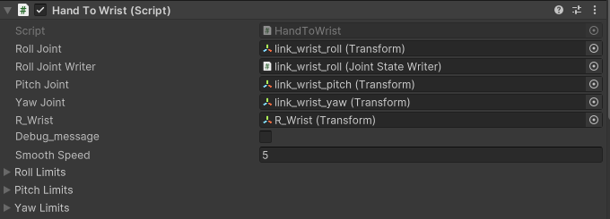
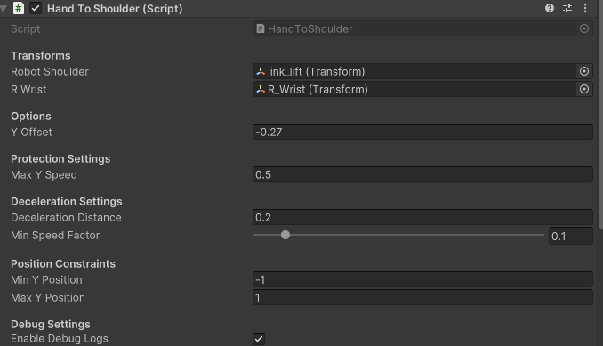
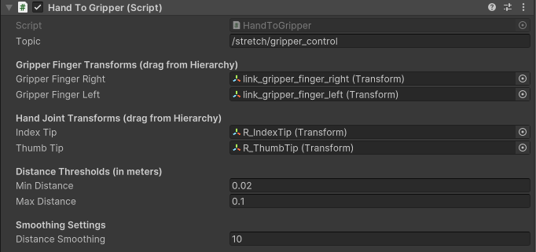

# Hand Tracking

This folder contains scripts for hand tracking in Unity.  
There are three main components:

1. **HandToWrist.cs**  
   Captures wrist rotation and sends it to the robot’s wrist.  
2. **HandToShoulder.cs**  
   Captures wrist position and sends it to the robot’s shoulder.  
3. **HandToGripper.cs**  
   Maps fingertip distance to control the gripper opening/closing.

---

## HandToWrist.cs Parameters

  

- **Public Transforms & Components**  
  - `rollJoint` (Transform): Joint rotating around Z-axis  
  - `pitchJoint` (Transform): Joint rotating around X-axis  
  - `yawJoint` (Transform): Joint rotating around Y-axis  
  - `R_Wrist` (Transform): Input wrist transform for rotation control  
  - `rollJointWriter` (JointStateWriter): Writes roll joint values (radians)

- **Debug**  
  - `debug_message` (bool): Print roll/pitch/yaw angles at runtime (default: `false`)

- **Smoothing**  
  - `smoothSpeed` (float): Interpolation speed for pitch & yaw (default: `5.0`)

- **Joint Angle Limits**  
  - `rollLimits.Min` (°): Min roll angle (default: `-160`)  
  - `rollLimits.Max` (°): Max roll angle (default: `160`)  
  - `pitchLimits.Min` (°): Min pitch angle (default: `-32`)  
  - `pitchLimits.Max` (°): Max pitch angle (default: `90`)  
  - `yawLimits.Min` (°): Min yaw angle (default: `-100`)  
  - `yawLimits.Max` (°): Max yaw angle (default: `100`)

---

## HandToShoulder.cs Parameters

  

- **Transforms**  
  - `Robot Shoulder` (Transform): Target shoulder joint  
  - `R_Wrist` (Transform): Source wrist — its world Y is the target

- **Options**  
  - `yOffset` (float): Vertical offset added to `R_Wrist` Y

- **Protection Settings**  
  - `maxYSpeed` (float): Max Y-position change per second

- **Deceleration Settings**  
  - `decelerationDistance` (float): Distance to start slowing down  
  - `minSpeedFactor` (0–1): Min speed multiplier near target

- **Position Constraints**  
  - `minYPosition` (float): Lower Y bound  
  - `maxYPosition` (float): Upper Y bound

- **Debug Settings**  
  - `enableDebugLogs` (bool): Log current, target & clamped Y each frame

---

## HandToGripper.cs Parameters

  

- **ROS Topic**  
  - **Topic**: `/stretch/gripper_control`  
  - **Message Type**: `std_msgs/Float64`  
  - **Description**: Publishes gripper target angle (°) based on fingertip distance

- **Gripper Finger Transforms**  
  - `gripperFingerRight` (Transform): e.g. `link_gripper_finger_right`  
  - `gripperFingerLeft` (Transform): e.g. `link_gripper_finger_left`

- **Hand Joint Transforms**  
  - `indexTip` (Transform): Index fingertip  
  - `thumbTip` (Transform): Thumb fingertip

- **Gripper Control Settings**  
  - `maxOpenAngle` (°): Fully open (default: `29`)  
  - `closedAngle` (°): Fully closed (default: `0`)

- **Distance Thresholds**  
  - `minDistance` (m): Below ⇒ closed (default: `0.02`)  
  - `maxDistance` (m): Above ⇒ fully open (default: `0.1`)

- **Smoothing Settings**  
  - `distanceSmoothing` (float): Higher = less smoothing (default: `10`)  
  - `rotationSpeed` (float): Interpolation speed (0 = instant; default: `0`)
