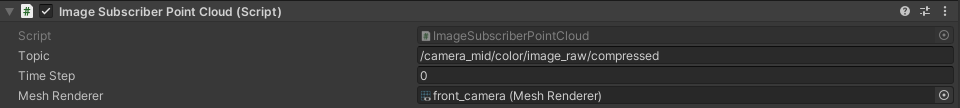
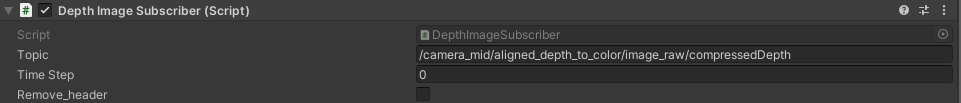
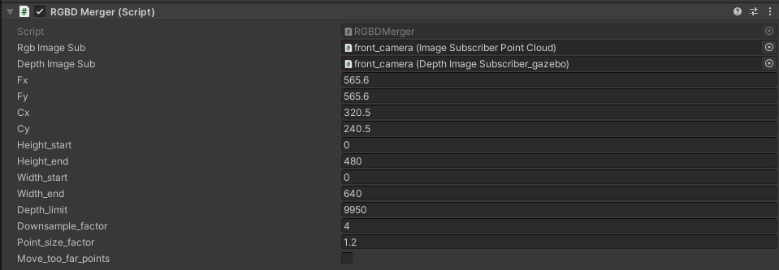
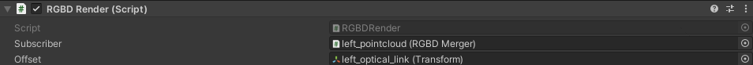

# Point Cloud Streaming
This is a function script folder for reconstruct RGBD image back to point-cloud in 3D space.  
Five main components for point-cloud reconstruction shows below:  
1.ImageSubscriberPointCloud.cs: subscribe the compressed RGB image data and project it on a plane.   
2.DepthImageSubscriber.cs: subscribe the compressed Depth image.   
3.RGBDMerger.cs: Fill in the camera intrinsics and calculate the point-cloud back to 3D space coordinate.  
4.RGBDRender.cs: Draw the 3D pointcloud into 3D space with shader.  
5.UnlitPointCloudGeometryShader.shader: draw a box point-cloud with 2 triangle and accelerate with geometry shader.  

## ImageSubscriberPointCloud.cs Parameter

* Topic: RGB image topic name (must be CompressedImage)
* Timestamp: remain default 0 (unused)
* Mesh Renders: choose a series of Plane gameobject to project the image (all will show the same image)

## DepthImageSubscriber.cs Parameter

* Topic: Depth image topic name (must be CompressedImage)
* Timestamp: remain default 0 (unused)
* Remove_header: remove the first 12 bytes of prefix of compressed image (Disable when the prefix is remove in ROS side)

## RGBDMerger Parameter

* Rgb Image Sub: Gameobject contain ImageSubscriberPointCloud.cs script
* Depth Image Sub: Gameobject contain DepthImageSubscriber.cs script
* Fx,Fy,Cx,Cy: Camera Intrinsic matrix, check from rgb/camera_info topic [camera_info_msgs](https://docs.ros.org/en/noetic/api/sensor_msgs/html/msg/CameraInfo.html)
* Height_start: start pixel crop the image height 
* Height_end: end pixel crop the image height
* Width_start: start pixel crop the image width
* Width_end: end pixel crop the image width
* Depth_limit: maximum distance of depth image (unit: mm)
* Downsample_factor: factor to skip calculation of point-cloud pixel (1 -> calculate all pixels)
* Point_size_factor: factor to enlarge or shrink pointcloud size (type: float)
* Move_too_far_points: Bool for remove out of Depth_limit point to depth limit distance. 

## RGBDRender Parameter

* Subscriber: gameobject contain RGBDMerge.cs
* Offset: GameObject of the camera_optical_frame (you need to create a gameobject to micmic as the camera_optical_frame in ROS)

