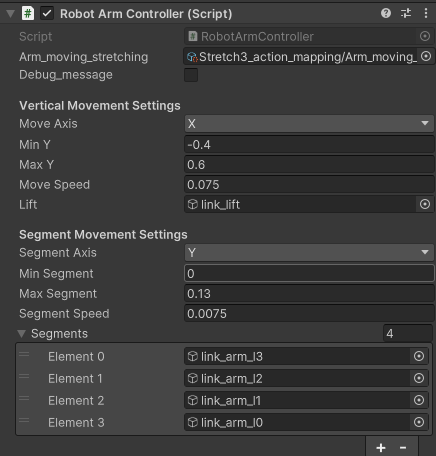
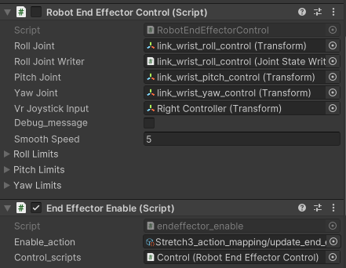
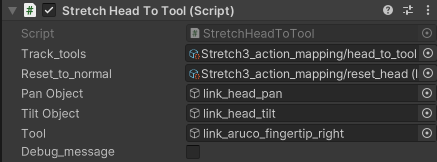
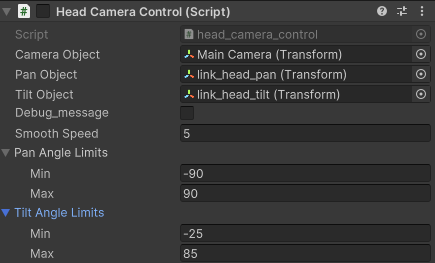
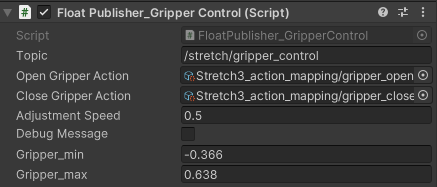
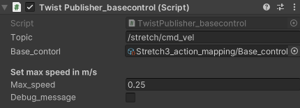

# Stretch_control
This is a script folder for control stretch 3 robot.
## RobotArmController.cs
The cobtrol scripts of arm lift and sctretch via right joy(unity new input system) value.  

* Arm_moving_streching: New unity input system event
* Debug_message: show the input value in Console
* Vertical Movement Settings: moving axis, min, max, movespeed, lift gameobject
* Segment Movement Settings: segment axis, min, max, movespeed, segment gameobjects
## RobotEndEffectorControl.cs & EndEffectorEnable.cs
End effector control function is done by RobotEndEffector Control (micmic the VR right hand joy stick to stretch 3 wrist), EndEffectorEnable (manually enable RobotEndEffector Control to avoid error movement).

1. RobotEndEffectorControl.cs
micmic the VR joystick pose to stretch3 arm wirst roll pitch yaw
* RollJoint: Transfrom of roll joint gameobject
* RollJoint Writer: joint state writer for roll joint (use joint state method to update robot roll joint)
* PitchJoint:  Transfrom of roll joint gameobject
* YawJoint: Transfrom of roll joint gameobject
* VrJoystickinput: Transfrom of right hand joystick gameobject (pose)
* Debug_message: Bool for show data in Console
* SmoothSpeed: speed factor of delta angle
* Roll, Pitch, Yaw angle limits: limit angles of roll pitch yaw
2. EndeffectorEnable.cs
Use right hand VR grip button to enable the RobotEndEffectorControl.cs function
* Enable_action: New unity input system to bind event and input device (VR right hand grip button)
* Control Scripts: the RobotEndEffectorControl.cs to enable and disable

## StretchHeadToTool
Use vr left hand joy button to control stretch head to look at end effector and look foward

* Track_tools & Reset_to_normal: New unity input system to bind event and input device (Left hand X Y button)
* Pan Tilt Object: GameObject for pan tilt joint gameobject
* Tool: GameObject of target object (gripper)
* Debug_message: show the value of vector from head to tool

## head_camera_control.cs
Use Vr head pose to control stretch 3 head rotation (pan, tilt)

* Camera Object: Camera tracking with VR device
* Pan, Tilt Object: Stretch 3 pan tilt joint
* Debug_message: Show value on console
* Smooth speed: speed factor for rotation
* Pan Tilt angle limits

## FloatPublisher_GripperControl.cs
Use VR right hand button (B, A) to control Gripper open and close (keep pushing button to move gripper)

* Topic: topic for stretch3 to control gripper open & close
* Open Gripper Action / Close Gripper Action: New unity input system (VR right joy button B / A)
* adjustment speed: speed for close and open
* Debug_message: show gripper current value on console
* Gripper_min / Gripper_max: full close / full open value of gripper 

## TwistPublisher_baseControl.cs
Use VR left hand joy to control stretch3 base linear.x angular.z value

* Topic: topic for stretch 3 to control command velocity
* Base control: New unity input system method (VR left joy value)
* Max_speed: Max speed factor in m/s
* Debug_message: show input joy value on console