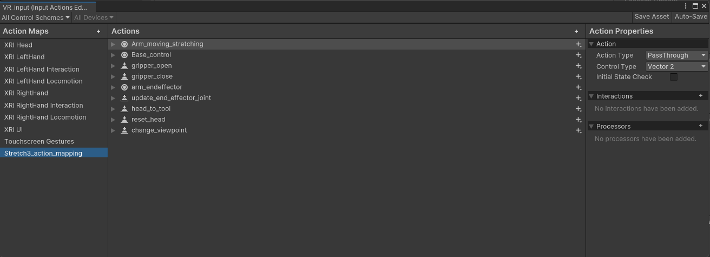
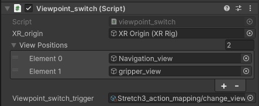

# VR_device
This is a folder for VR device (in unity only) function script folder. The functions only in unity and doesnot related with robot / ROS# will in this folder.  
Before you check the New unity input system video to learn now to use the input system by event. [Link](https://www.bilibili.com/video/BV14pSbYsEPz?vd_source=833d1792bb1403edf55c448f13511407&spm_id_from=333.788.videopod.sections)

## VR_input.inputactions
New unity input system setup file, stretch3_action mapping is the event with key binding for control stretch3 robot.

## Viewpoint_switch.cs
Using this scripts, main camera can switch to differenet position in View positions list.

* XR_origin: the gameobject of XR_origin (the origin will move to different position, and main camera is the children of xr_origin)
* View Poaitions: a gameobject list to get the position of gameobject and omve the xr_origin to it.
* Viewpoint_switch_trigger: new unity input system event to trigger view point switch (vr righthand trigger button)